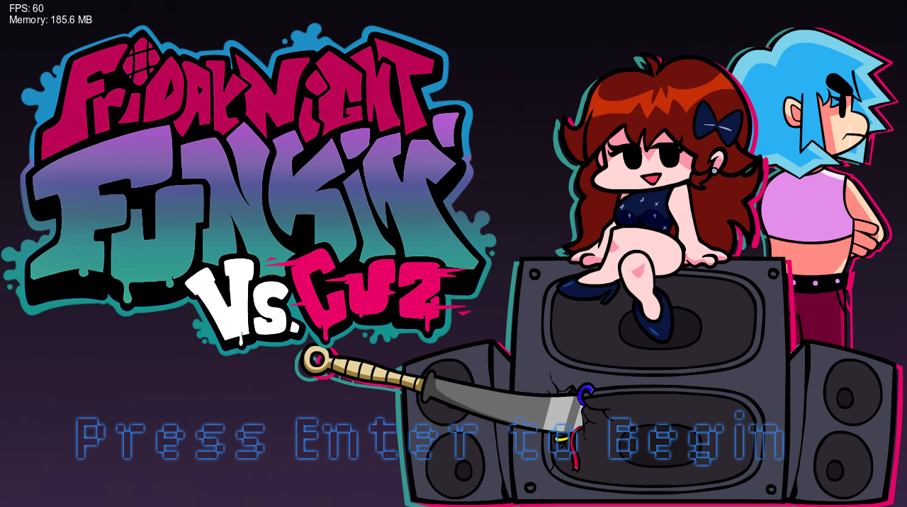
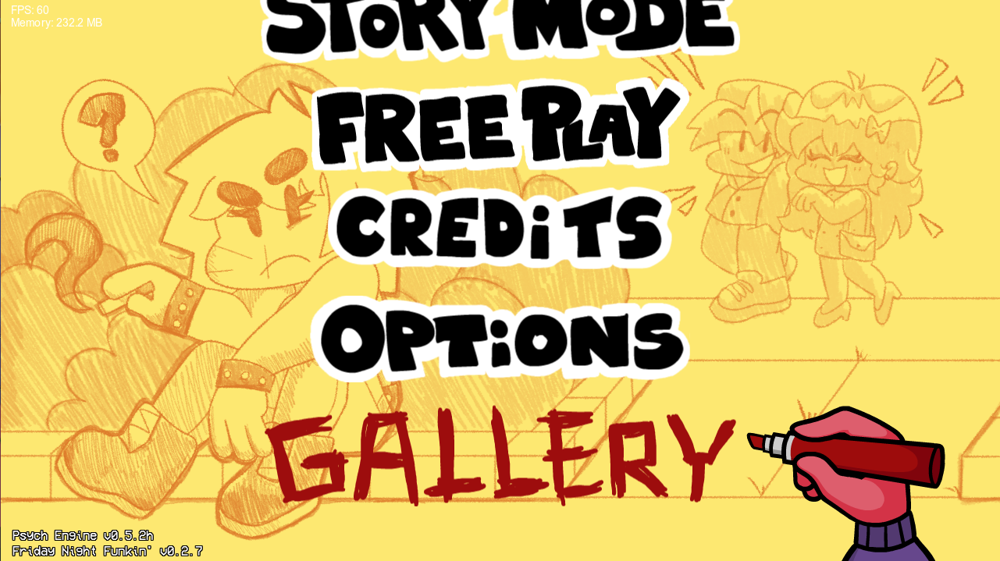
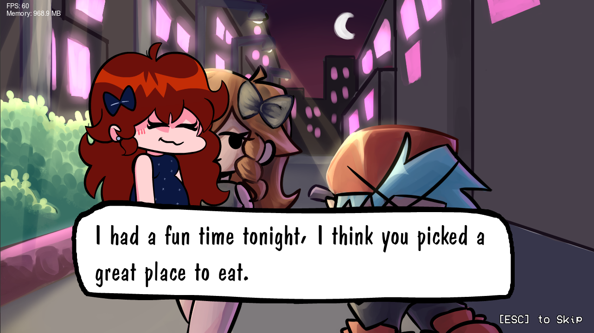
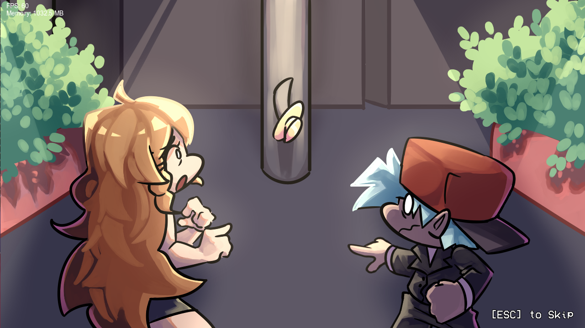
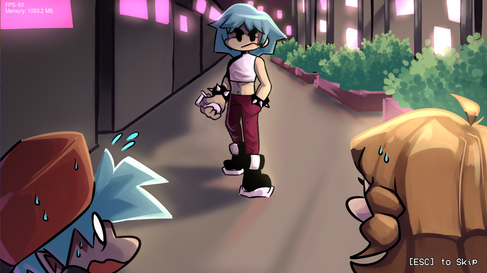
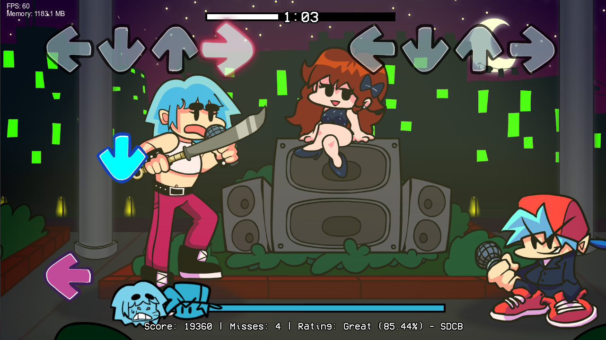

# Friday Night Funkin' - Kick Ass Kin
While coming home from a late night date, BF and GF run into BF's cousin Cuz, a seasoned demon hunter who's been after GF for a long time - and they won't let her leave without a battle.

## Installation:
Just download the files for the .exe!

heres this page for da source :)
placeholder

## Vs. Cuz Team:
* Acrylicqueen - Director, Sprite Artist, Writer, Background Artist
* EvilsCorner - Director, Sprite Animator, Background Artist
* Splootulu - Cutscene Artist
* Crashtroid - Composer, Charting
* Damonj17_ - Composer, Charting
* Sikowny - Coder

## Psyche Engine Credits:
* Shadow Mario - Coding
* RiverOaken - Arts and Animations
* bbpanzu - Assistant Coding

### Psyche Engine Special Thanks
* shubs - New Input System
* SqirraRNG - Chart Editor's Sound Waveform base code
* iFlicky - Delay/Combo Menu Song Composer + Dialogue Sounds
* PolybiusProxy - .MP4 Loader Extension
* Keoiki - Note Splash Animations
* Smokey - Spritemap Texture Atlas support
* Cary - OG Resolution code
* Nebula_Zorua - VCR Shader code
_____________________________________

# Features

Unlockable Gallery!

Cutscenes + Custom music!

Stab Note Mechanic!

And More!

## Heres da stuff:
### Week Cuz:

### Week Bonus:
  * Playable after beating Week Cuz!
